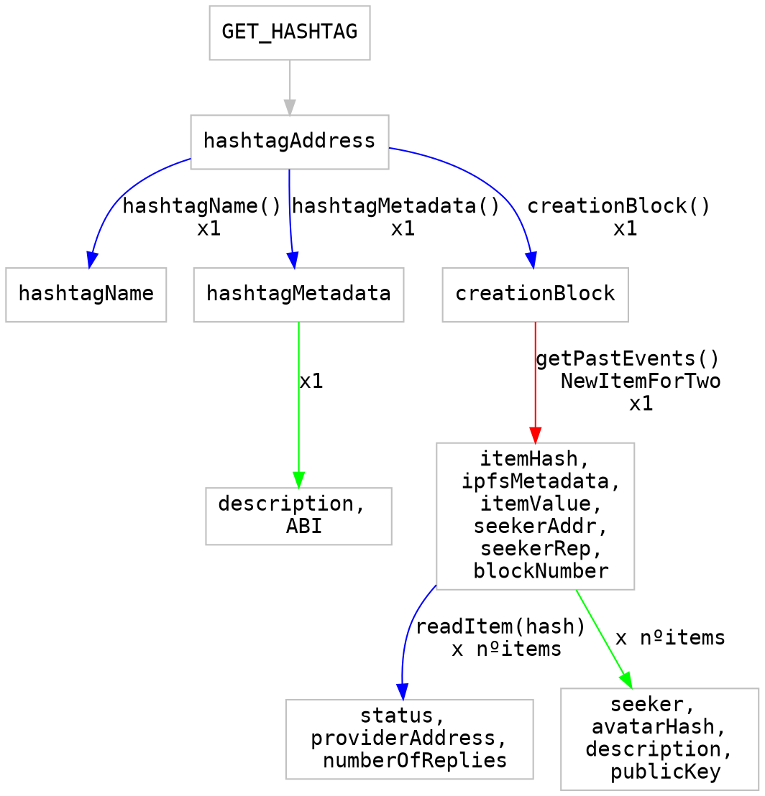
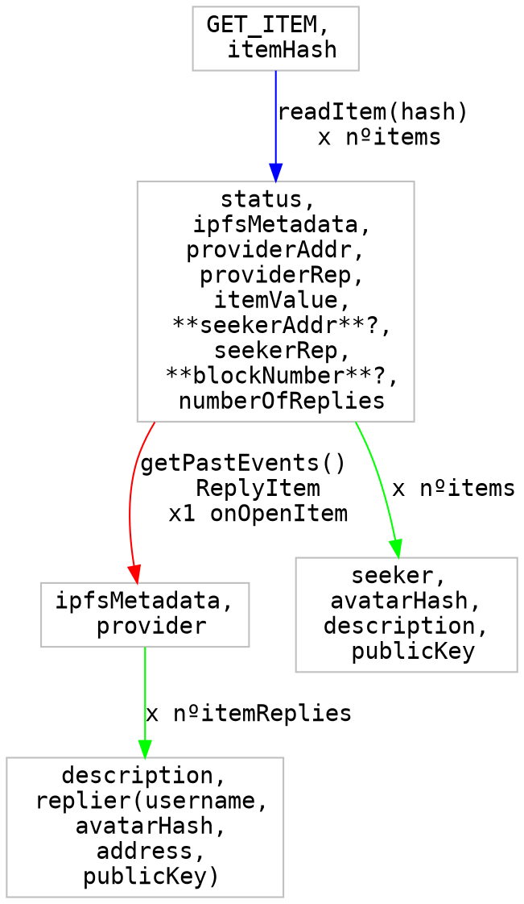
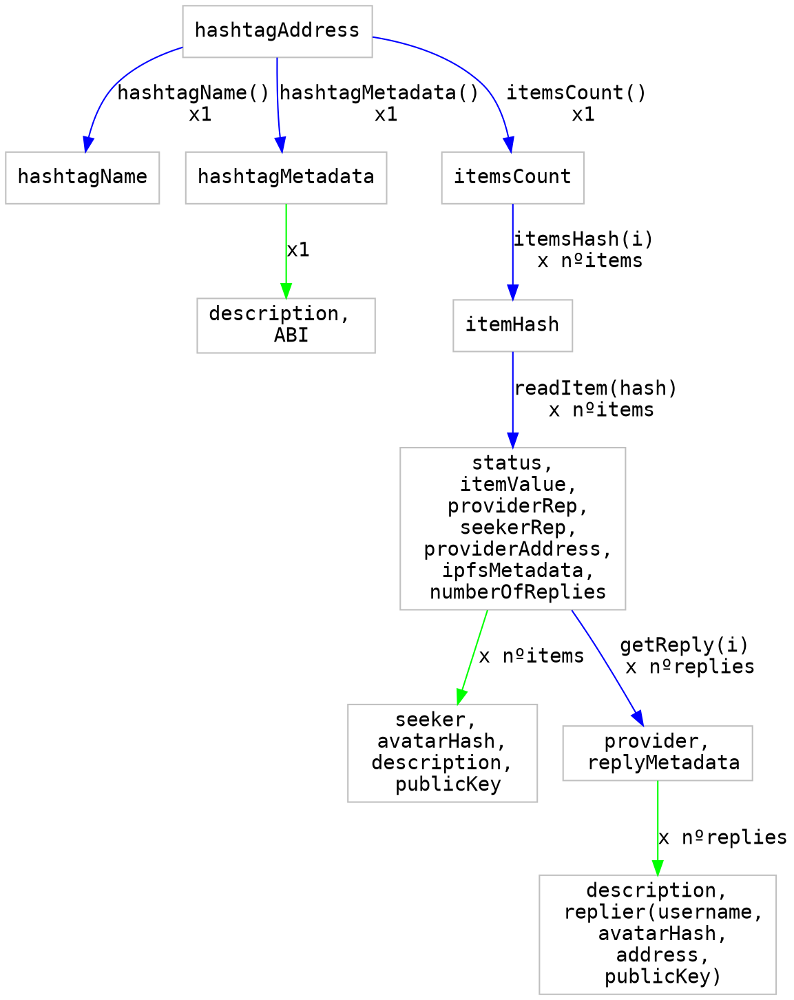

# SwarmCity Data Fetching strategy

## 1. Hashtag basic info
- hashtagName
- metadataHash

### Contract changes

- [x] When the state changes: Fire an event 
```
ItemChange(bytes32 indexed itemHash, status newstatus, address providerAddress)
```

- [x] Change event to
```
event NewItem(address owner, bytes32 itemHash, string ipfsMetadata, uint itemValue, uint hashtagFee, uint seekerRep);
```

- [x] Split readItem into
  - [x] readItemState: ```status, providerAddress, providerRep, numberOfReplies```
  - [x] readItemData: ```itemValue, seekerAddr, seekerRep, ipfsMetadata, creationBlock```

- [x] On item creation, store the ```creationBlock``` in the struct, so it can be returned in the ```readItemData``` call.

https://github.com/swarmcity/SwarmCityContracts/pull/17

## 2. Through Events
> Contract State
> [color=blue]

> Contract Events
> [color=red]

> IPFS cat
> [color=green]






## 2. Through State
> Contract State
> [color=blue]


> IPFS cat
> [color=green]



Reference for the graph code: http://www.tonyballantyne.com/graphs.html
Reference for hackmd features: https://hackmd.io/features?both